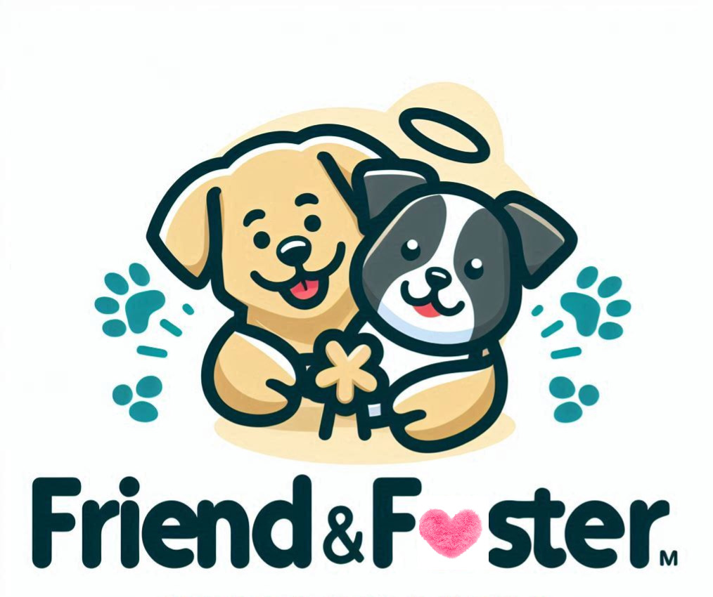

## Friend and Foster App ##

## License - This project is proprietary and protected under U.S. copyright law.  No part of this codebase may be used, copied, modified, or distributed without explicit written permission from the owner.
-----

I am developing a cloud-based application that allows background-verified personnel to rent rescue dogs from local shelters.

___________________

[❣ Contribute to funding Friend and Foster App ❣](https://angelink.com/fundraiser-public/d34d37e7-fa36-4454-97af-86369158125d)

Support Friend and Foster – Empower Connections, Make a Difference.

Click the link above to be directed to the Friend and Foster app's donation page! Our mission is to create a platform that brings people together, fosters meaningful and *pawwwsitive* friendships, and empowers communities and dogs in need. Your generous contributions will directly support the growth and development of this innovative app, helping us:
- Enhance features to better connect users and build lasting relationships.
- Maintain and improve the app’s user-friendly design and functionality.
- Expand our reach to foster more connections and positive impacts worldwide.

By donating, you’re not just funding an app—you’re investing in a vision of kindness, connection, and community. Every contribution, big or small, helps us move closer to creating a platform that truly makes a difference. Thank you for being a part of the Friend and Foster journey! 

____________________

## This code implements a console-based application called "Friend and Foster," which allows users to register, log in, view categorized rescue dog profiles, rent them and ultimately and hopefully rescue them. There is also an online shop to rent and buy products for the user's rescue rental and other furry friends the user may have at home. Here's a breakdown of how it works: ##

---
### 1. Data Storage ###

•	Users: Stored in an in-memory dictionary (users) where the key is the email, and the value is the password.

•	Verification Codes: A HashSet (validVerificationCodes) contains predefined admin-provided codes for account verification.

•	Dog Profiles:

•	A List<string> (dogProfiles) stores general dog profiles.

•	A nested dictionary (categorizedDogProfiles) organizes dog profiles by breed categories (e.g., "Toy Breed") and additional categories such as size, age, hypoallergenic status, and color.

---
### 2. Main Program Flow ###
The Main method serves as the entry point and displays a welcome message. It provides three options:
1.	Register: Calls the Register method to create a new user account.
2.	Login: Calls the Login method to authenticate an existing user.
3.	Exit: Terminates the program.
---
### 3. Registration Process ###
The Register method:
1.	Prompts the user for an email, password, and verification code.
2.	Validates the email format using the IsValidEmail method (regex-based).
3.	Checks if the email already exists in the users dictionary.
4.	Verifies the provided code against the validVerificationCodes set.
5.	If all checks pass, the user is registered, and their email/password is stored in the users dictionary.
6.	Redirects the user to view dog profiles by calling ShowDogProfiles.
---
### 4. Login Process ###
The Login method:
1.	Prompts the user for their email and password.
2.	Checks if the email exists in the users dictionary.
3.	Verifies the password against the stored value.
4.	Displays a success message if the credentials are correct; otherwise, it notifies the user of incorrect credentials.
---
### 5. Viewing Dog Profiles ###
The ShowDogProfiles method:
1.	Search for dog profile by any of the 50 states in America
2.  Then, search by any of the major cities in those states that Friend And Foster is currently available in
3. Prompts the user to select a category (e.g., "Breed", "Size", "Age", "Hypoallergenic", "Color").
4.	Prompts the user to select a subcategory within the chosen category:
   - **Size**: Options include "0-4 pounds", "6-12 pounds", "12-20 pounds", "20-30 pounds", "30 pounds and above".
   - **Age**: Options include "0-3 years", "4-7 years", "8-11 years", "12 and older".
   - **Hypoallergenic**: Options include "Yes" and "No".
   - **Color**: Options include "White", "Black", "Dapple", "Orange", "Red", "Grey".
5.	Displays the corresponding dog profiles from the categorizedDogProfiles dictionary.
6.	Handles invalid inputs by returning to the main menu.
---
### 6. Utility Method ###

•	IsValidEmail: Uses a regular expression to validate the format of an email address.

---
### Key Features ###
•	User Authentication: Ensures only verified users can register and log in.
•	Categorized Dog Profiles: Allows users to explore dog profiles based on breed, size, age, hypoallergenic status, and color.
•	Error Handling: Provides feedback for invalid inputs (e.g., incorrect email format, invalid category/age selection).

### 7. Shop Features ###
Users can shop for pet-related products, either renting or purchasing them. Below is the list of available products:

| Product                     | Hourly Rent | Daily Rent | Purchase Price |
|-----------------------------|-------------|------------|----------------|
| Leash                       | N/A         | $1         | $5             |
| Harness                     | N/A         | $1         | $10            |
| Dog Stroller                | $5          | $40        | $80            |
| Poop Bags                   | N/A         | N/A        | $5             |
| Dog Ear Wipes               | N/A         | N/A        | $5             |
| Dog Paw Wipes               | N/A         | N/A        | $5             |
| Dog Eye Drops               | N/A         | N/A        | $5            

